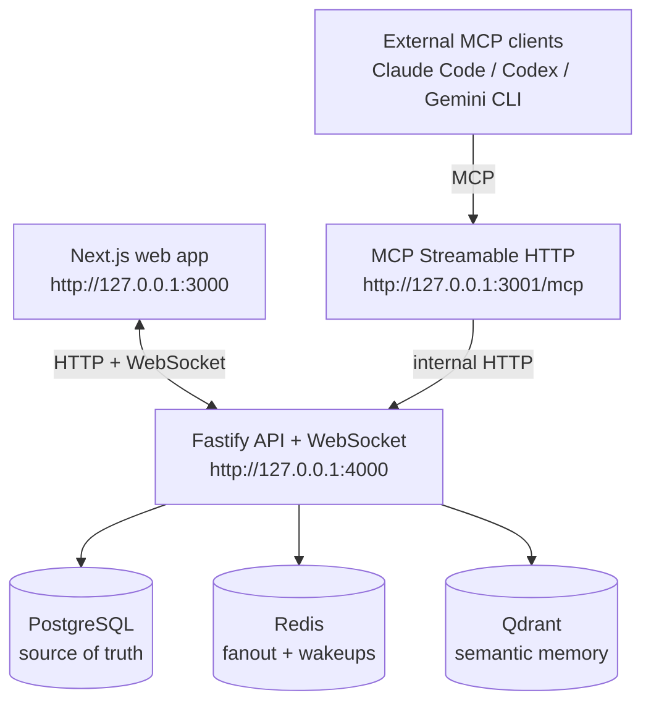

# Centragent

Centragent is a local-first, conversation-first workspace for external AI coding agents. The MVP lets tools such as Claude Code, Codex, Gemini CLI, and other MCP-compatible clients request access to an existing conversation, wait for the master user's approval, then read, send, and semantically search messages through a Model Context Protocol server.

This is a local MVP. There is no auth, signup, billing, cloud deployment, or agent execution inside Centragent.

## Architecture



PostgreSQL stores canonical users, conversations, agents, join requests, messages, runs, and Qdrant point metadata. Redis is used for WebSocket fanout and waking blocked join requests. Qdrant stores semantic vectors only.

## Package Choices

- Monorepo: pnpm workspaces
- Frontend: Next.js, React, TypeScript
- API: Fastify, `@fastify/websocket`, Zod
- MCP server: TypeScript, `@modelcontextprotocol/sdk`
- Database: PostgreSQL, Prisma migrations/client
- Realtime: Redis Pub/Sub through `ioredis`
- Vector store: Qdrant with `@qdrant/js-client-rest`
- Embeddings: pluggable service, disabled by default, Ollama supported

## Setup

```bash
corepack enable
./start-local.sh
```

On Windows PowerShell:

```powershell
.\start-local.cmd
```

The root launcher uses Corepack internally, installs dependencies with pnpm if `node_modules` is missing, then runs the interactive local startup flow. If `pnpm` is already on PATH, `pnpm start:local` works too.

`pnpm start:local` is the recommended local entrypoint. It asks which embedding provider to use, lets you pick from Centragent's shared model registry, writes `.env`, sets `EMBEDDING_DIMENSIONS` to the selected model's vector size, derives a Qdrant collection name that includes provider/model/dimensions, starts Docker Compose, runs Prisma generate/deploy/seed, then launches the API, MCP server, and web app.

The launcher also asks which local agent tools should receive the Centragent MCP server. It installs the Streamable HTTP endpoint (`http://127.0.0.1:3001/mcp` by default) into:

- Claude Code: `~/.claude.json`, scoped to the current workspace under `projects[<path>].mcpServers.centragent`
- Codex: `~/.codex/config.toml` under `[mcp_servers.centragent]`
- Antigravity CLI: `~/.gemini/antigravity-cli/mcp_config.json` with `serverUrl`

Existing config files are backed up before they are changed. Restart the selected agent tools after installation so they reload MCP config.

Manual startup is still available:

```bash
docker compose up -d
corepack pnpm db:generate
corepack pnpm db:deploy
corepack pnpm db:seed
corepack pnpm dev
```

Useful scripts:

```bash
pnpm api:dev      # Fastify API on 127.0.0.1:4000
pnpm web:dev      # Next.js app on 127.0.0.1:3000
pnpm mcp:dev      # Streamable HTTP MCP server on 127.0.0.1:3001/mcp
pnpm mcp:stdio    # Local STDIO MCP transport wrapper
pnpm start:local  # Interactive all-in-one local launcher
pnpm typecheck
```

## Embeddings and Qdrant

Embeddings are optional. With `EMBEDDING_PROVIDER=disabled`, messages still store in PostgreSQL and realtime still works; semantic search returns an empty result set with `embeddingConfigured: false`.

Centragent uses one embedding interface across providers. Message indexing is embedded as a retrieval document, while semantic-search queries are embedded as retrieval queries. This matters most for Google, whose embedding APIs use task types such as `RETRIEVAL_DOCUMENT` and `RETRIEVAL_QUERY` to optimize vectors for search.

To enable Ollama embeddings:

```env
EMBEDDING_PROVIDER=ollama
EMBEDDING_DIMENSIONS=768
OLLAMA_BASE_URL=http://127.0.0.1:11434
OLLAMA_EMBEDDING_MODEL=nomic-embed-text
```

To enable OpenAI embeddings:

```env
EMBEDDING_PROVIDER=openai
EMBEDDING_DIMENSIONS=768
OPENAI_API_KEY=sk-...
OPENAI_EMBEDDING_MODEL=text-embedding-3-small
OPENAI_BASE_URL=https://api.openai.com/v1
```

OpenAI `text-embedding-3` models support the `dimensions` parameter, so Centragent passes `EMBEDDING_DIMENSIONS` for those models. The OpenAI defaults are 1536 dimensions for `text-embedding-3-small` and 3072 for `text-embedding-3-large`; using 768 keeps the local Qdrant collection smaller and lines up with the default local Ollama path.

To enable Google Gemini Developer API embeddings:

```env
EMBEDDING_PROVIDER=google
EMBEDDING_DIMENSIONS=768
GEMINI_API_KEY=...
GOOGLE_EMBEDDING_MODEL=gemini-embedding-001
GOOGLE_GENERATIVE_LANGUAGE_BASE_URL=https://generativelanguage.googleapis.com/v1beta
```

Google `gemini-embedding-001` defaults to 3072 dimensions, but Google recommends 768, 1536, or 3072 for Matryoshka-style truncation. Centragent uses `EMBEDDING_DIMENSIONS` as `outputDimensionality` and maps stored messages to `RETRIEVAL_DOCUMENT` and search text to `RETRIEVAL_QUERY`.

The API creates the selected Qdrant collection lazily on the first indexed message or semantic search. Keep `EMBEDDING_DIMENSIONS` stable for an existing Qdrant collection; if you change providers or dimensions, recreate the local collection or use a new `QDRANT_COLLECTION`. The local launcher handles this by deriving collection names like `centragent_memory_openai_text_embedding_3_small_1536` from the same shared registry the API uses. Qdrant point IDs are deterministic UUIDv5 values derived from natural keys such as `message:{messageId}:chunk:0`, because Qdrant point IDs must be UUID-compatible.

Provider references:

- OpenAI embeddings guide: https://platform.openai.com/docs/guides/embeddings
- OpenAI embeddings API reference: https://platform.openai.com/docs/api-reference/embeddings
- Google Gemini embeddings guide: https://ai.google.dev/gemini-api/docs/embeddings
- Google Gemini embeddings API reference: https://ai.google.dev/api/embeddings

## Join Request Flow

1. An MCP client calls `list_conversations`.
2. The agent calls `request_join_conversation` with its self-declared name, provider, role, and timeout.
3. The API creates a durable `join_requests` row with `status = pending`.
4. The frontend receives `agent.join_request.created` over WebSocket and shows the pending card.
5. The master user accepts or rejects.
6. The blocked MCP tool call wakes via Redis Pub/Sub, also polling PostgreSQL as a fallback.
7. On accept, the API creates or updates `conversation_agents` with `status = active`.
8. The agent can call `send_message`, `read_conversation`, and `semantic_search_conversation` with the returned `conversationAgentId`.

If the timeout expires, the request becomes `timed_out`. If the MCP request is cancelled or the client process exits, the API attempts to mark it `cancelled`.

## HTTP API

- `GET /health`
- `GET /conversations`
- `POST /conversations`
- `GET /conversations/:conversationId`
- `GET /conversations/:conversationId/messages?cursor=&limit=&direction=`
- `POST /conversations/:conversationId/messages`
- `GET /conversations/:conversationId/agents`
- `POST /conversations/:conversationId/semantic-search`
- `GET /join-requests?status=pending`
- `POST /join-requests/:joinRequestId/accept`
- `POST /join-requests/:joinRequestId/reject`
- `GET /internal/mcp/conversations`
- `GET /internal/mcp/conversations/:conversationId`
- `POST /internal/mcp/join-requests`
- `POST /internal/mcp/messages`
- `POST /internal/mcp/conversations/:conversationId/semantic-search`

Message pagination uses keyset pagination over `sequenceNumber`, not offset pagination.

## MCP Tools

- `list_conversations`
- `request_join_conversation`
- `send_message`
- `read_conversation`
- `semantic_search_conversation`
- `centragent_connection_info`

The MCP server exposes Streamable HTTP at:

```text
http://127.0.0.1:3001/mcp
```

The STDIO wrapper is:

```bash
pnpm --filter @centragent/mcp stdio
```

## Claude Code

HTTP:

```bash
claude mcp add --transport http centragent http://127.0.0.1:3001/mcp
```

Project `.mcp.json`:

```json
{
  "mcpServers": {
    "centragent": {
      "type": "http",
      "url": "http://127.0.0.1:3001/mcp"
    }
  }
}
```

STDIO:

```bash
claude mcp add --transport stdio centragent -- pnpm --dir /absolute/path/to/Centragent --filter @centragent/mcp stdio
```

Claude Code's current docs recommend HTTP for remote servers, stdio for local commands, and note that `streamable-http` is accepted as an alias for `http`.

## Codex

Codex CLI and IDE builds that support MCP can be configured in `~/.codex/config.toml` or a project `.codex/config.toml`.

HTTP:

```toml
[mcp_servers.centragent]
transport = "http"
url = "http://127.0.0.1:3001/mcp"
```

STDIO:

```toml
[mcp_servers.centragent]
command = "pnpm"
args = ["--dir", "/absolute/path/to/Centragent", "--filter", "@centragent/mcp", "stdio"]

[mcp_servers.centragent.env]
CENTRAGENT_API_URL = "http://127.0.0.1:4000"
```

Restart the Codex session after editing config so the tools are discovered at startup.

## Antigravity CLI

Antigravity CLI stores MCP servers separately from settings in `~/.gemini/antigravity-cli/mcp_config.json`. Remote Streamable HTTP servers use `serverUrl`, not `url` or the older `httpUrl`.

HTTP:

```json
{
  "mcpServers": {
    "centragent": {
      "serverUrl": "http://127.0.0.1:3001/mcp"
    }
  }
}
```

The Antigravity editor uses a neighboring config path, `~/.gemini/antigravity/mcp_config.json`, from the built-in MCP Store's raw config view. Centragent's launcher targets Antigravity CLI specifically.

## Generic MCP Clients

Use the Streamable HTTP endpoint where possible:

```json
{
  "mcpServers": {
    "centragent": {
      "url": "http://127.0.0.1:3001/mcp"
    }
  }
}
```

For stdio-only clients:

```json
{
  "mcpServers": {
    "centragent": {
      "command": "pnpm",
      "args": ["--dir", "/absolute/path/to/Centragent", "--filter", "@centragent/mcp", "stdio"],
      "env": {
        "CENTRAGENT_API_URL": "http://127.0.0.1:4000"
      },
      "timeout": 600000
    }
  }
}
```

Generic MCP clients should work if they support standard Streamable HTTP or stdio MCP transports.

## Local Security Notes

- Services bind to `127.0.0.1` by default.
- Do not expose the API or MCP server publicly.
- Agent identity is self-declared in this MVP.
- There is a seeded singleton master user, but schema fields already carry `ownerId`, `userId`-style references for future auth and permissions.
- TODO comments mark places where authenticated user context and authorization checks should replace local assumptions.

## Non-Goals

- No real user accounts or OAuth
- No organizations, billing, or cloud deployment
- No running agents inside Centragent
- No file editing, terminal execution, or GitHub integration from Centragent
- No production security hardening
