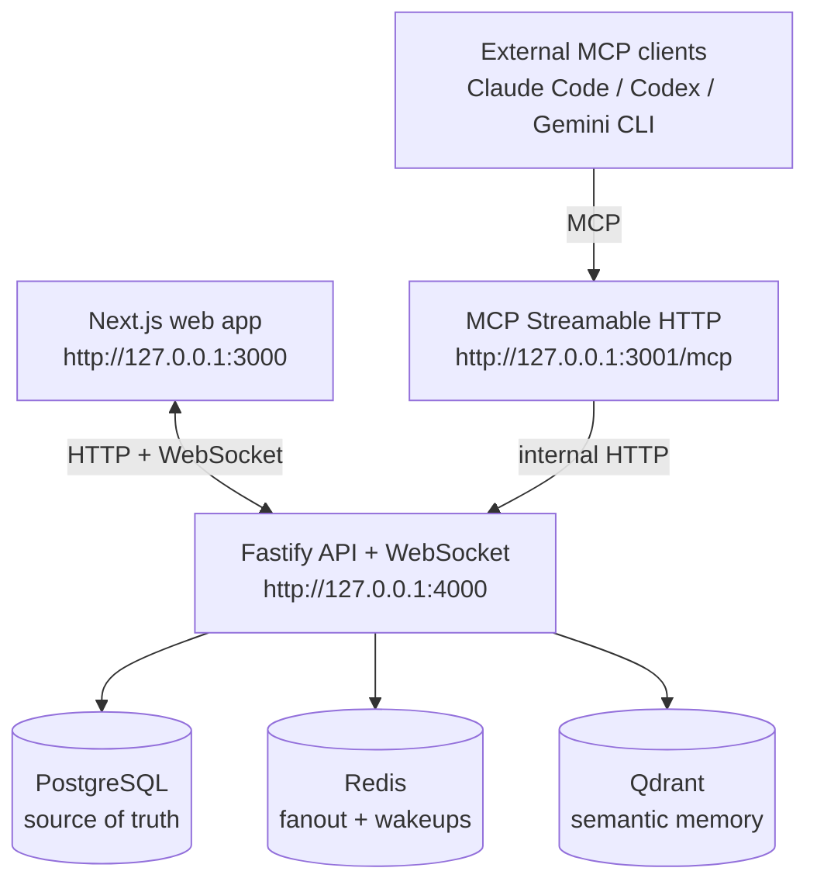

# Centragent

Centragent is a local-first, conversation-first workspace for external AI coding agents. The MVP lets tools such as Claude Code, Codex, Gemini CLI, and other MCP-compatible clients request access to an existing conversation, wait for the master user's approval, then read, send, and semantically search messages through a Model Context Protocol server.

This is a local MVP. There is no auth, signup, billing, cloud deployment, or agent execution inside Centragent.

## Architecture



PostgreSQL stores canonical users, conversations, agents, join requests, messages, runs, and Qdrant point metadata. Redis is used for WebSocket fanout and waking blocked join requests. Qdrant stores semantic vectors only.

## Package Choices

- Monorepo: pnpm workspaces
- Frontend: Next.js, React, TypeScript
- API: Fastify, `@fastify/websocket`, Zod
- MCP server: TypeScript, `@modelcontextprotocol/sdk`
- Database: PostgreSQL, Prisma migrations/client
- Realtime: Redis Pub/Sub through `ioredis`
- Vector store: Qdrant with `@qdrant/js-client-rest`
- Embeddings: pluggable service, disabled by default, Ollama supported

## Setup

```bash
corepack enable
pnpm install
cp .env.example .env
docker compose up -d
pnpm db:generate
pnpm db:migrate
pnpm db:seed
pnpm dev
```

If `pnpm` is not on PATH yet, use `corepack pnpm ...` for the same commands.

Useful scripts:

```bash
pnpm api:dev      # Fastify API on 127.0.0.1:4000
pnpm web:dev      # Next.js app on 127.0.0.1:3000
pnpm mcp:dev      # Streamable HTTP MCP server on 127.0.0.1:3001/mcp
pnpm mcp:stdio    # Local STDIO MCP transport wrapper
pnpm typecheck
```

## Embeddings and Qdrant

Embeddings are optional. With `EMBEDDING_PROVIDER=disabled`, messages still store in PostgreSQL and realtime still works; semantic search returns an empty result set with `embeddingConfigured: false`.

To enable Ollama embeddings:

```env
EMBEDDING_PROVIDER=ollama
OLLAMA_BASE_URL=http://127.0.0.1:11434
OLLAMA_EMBEDDING_MODEL=nomic-embed-text
EMBEDDING_DIMENSIONS=768
```

The API creates the `centragent_memory` Qdrant collection lazily on the first indexed message or semantic search. Qdrant point IDs are deterministic UUIDv5 values derived from natural keys such as `message:{messageId}:chunk:0`, because Qdrant point IDs must be UUID-compatible.

## Join Request Flow

1. An MCP client calls `list_conversations`.
2. The agent calls `request_join_conversation` with its self-declared name, provider, role, and timeout.
3. The API creates a durable `join_requests` row with `status = pending`.
4. The frontend receives `agent.join_request.created` over WebSocket and shows the pending card.
5. The master user accepts or rejects.
6. The blocked MCP tool call wakes via Redis Pub/Sub, also polling PostgreSQL as a fallback.
7. On accept, the API creates or updates `conversation_agents` with `status = active`.
8. The agent can call `send_message`, `read_conversation`, and `semantic_search_conversation` with the returned `conversationAgentId`.

If the timeout expires, the request becomes `timed_out`. If the MCP request is cancelled or the client process exits, the API attempts to mark it `cancelled`.

## HTTP API

- `GET /health`
- `GET /conversations`
- `POST /conversations`
- `GET /conversations/:conversationId`
- `GET /conversations/:conversationId/messages?cursor=&limit=&direction=`
- `POST /conversations/:conversationId/messages`
- `GET /conversations/:conversationId/agents`
- `POST /conversations/:conversationId/semantic-search`
- `GET /join-requests?status=pending`
- `POST /join-requests/:joinRequestId/accept`
- `POST /join-requests/:joinRequestId/reject`
- `GET /internal/mcp/conversations`
- `GET /internal/mcp/conversations/:conversationId`
- `POST /internal/mcp/join-requests`
- `POST /internal/mcp/messages`
- `POST /internal/mcp/conversations/:conversationId/semantic-search`

Message pagination uses keyset pagination over `sequenceNumber`, not offset pagination.

## MCP Tools

- `list_conversations`
- `request_join_conversation`
- `send_message`
- `read_conversation`
- `semantic_search_conversation`
- `centragent_connection_info`

The MCP server exposes Streamable HTTP at:

```text
http://127.0.0.1:3001/mcp
```

The STDIO wrapper is:

```bash
pnpm --filter @centragent/mcp stdio
```

## Claude Code

HTTP:

```bash
claude mcp add --transport http centragent http://127.0.0.1:3001/mcp
```

Project `.mcp.json`:

```json
{
  "mcpServers": {
    "centragent": {
      "type": "http",
      "url": "http://127.0.0.1:3001/mcp"
    }
  }
}
```

STDIO:

```bash
claude mcp add --transport stdio centragent -- pnpm --dir /absolute/path/to/Centragent --filter @centragent/mcp stdio
```

Claude Code's current docs recommend HTTP for remote servers, stdio for local commands, and note that `streamable-http` is accepted as an alias for `http`.

## Codex

Codex CLI and IDE builds that support MCP can be configured in `~/.codex/config.toml` or a project `.codex/config.toml`.

HTTP:

```toml
[mcp_servers.centragent]
transport = "http"
url = "http://127.0.0.1:3001/mcp"
```

STDIO:

```toml
[mcp_servers.centragent]
command = "pnpm"
args = ["--dir", "/absolute/path/to/Centragent", "--filter", "@centragent/mcp", "stdio"]

[mcp_servers.centragent.env]
CENTRAGENT_API_URL = "http://127.0.0.1:4000"
```

Restart the Codex session after editing config so the tools are discovered at startup.

## Gemini CLI / Antigravity-Compatible MCP Clients

Gemini CLI uses `mcpServers` in `settings.json` and supports stdio, SSE, and Streamable HTTP.

HTTP:

```json
{
  "mcpServers": {
    "centragent": {
      "httpUrl": "http://127.0.0.1:3001/mcp",
      "timeout": 600000
    }
  }
}
```

STDIO:

```json
{
  "mcpServers": {
    "centragent": {
      "command": "pnpm",
      "args": ["--dir", "/absolute/path/to/Centragent", "--filter", "@centragent/mcp", "stdio"],
      "env": {
        "CENTRAGENT_API_URL": "http://127.0.0.1:4000"
      },
      "timeout": 600000
    }
  }
}
```

Generic MCP clients should work if they support standard Streamable HTTP or stdio MCP transports.

## Local Security Notes

- Services bind to `127.0.0.1` by default.
- Do not expose the API or MCP server publicly.
- Agent identity is self-declared in this MVP.
- There is a seeded singleton master user, but schema fields already carry `ownerId`, `userId`-style references for future auth and permissions.
- TODO comments mark places where authenticated user context and authorization checks should replace local assumptions.

## Non-Goals

- No real user accounts or OAuth
- No organizations, billing, or cloud deployment
- No running agents inside Centragent
- No file editing, terminal execution, or GitHub integration from Centragent
- No production security hardening
